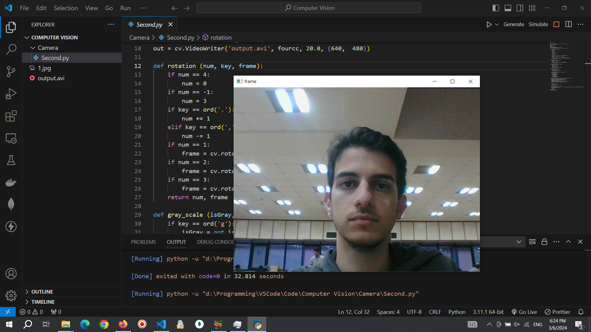
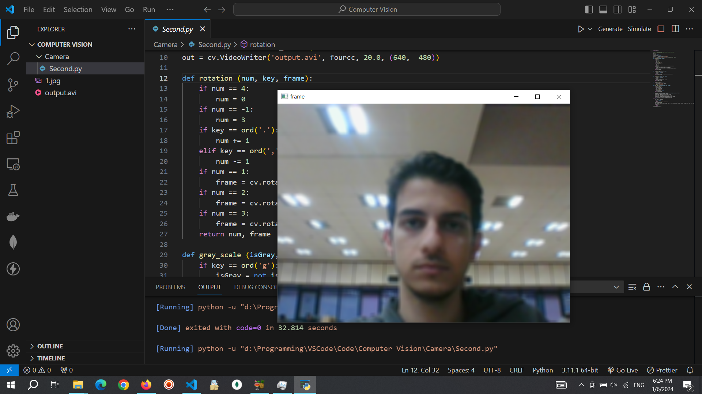
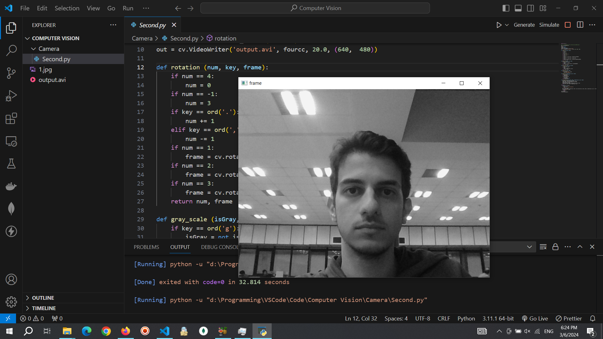
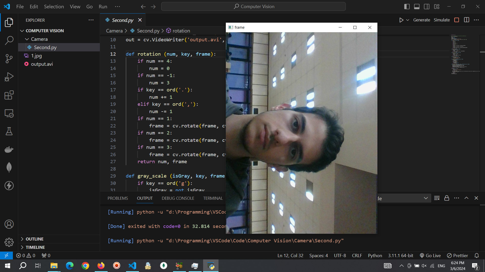

# Custom-Camera
Custom Camera with python and OpenCV Library

## Live Camera and Capture Photo with 's' button

## Blur Option with 'b' Button

## GrayScale Option with 'g' button

## Rotate Option with '<' and '>' buttons

## Capture Video Option start with 'c' button and end with 'v' button
<video autoplay loop style="width:100%; height: auto; position:absolute;">
  <source src="output.avi" type="video/avi" />
  
</video>

